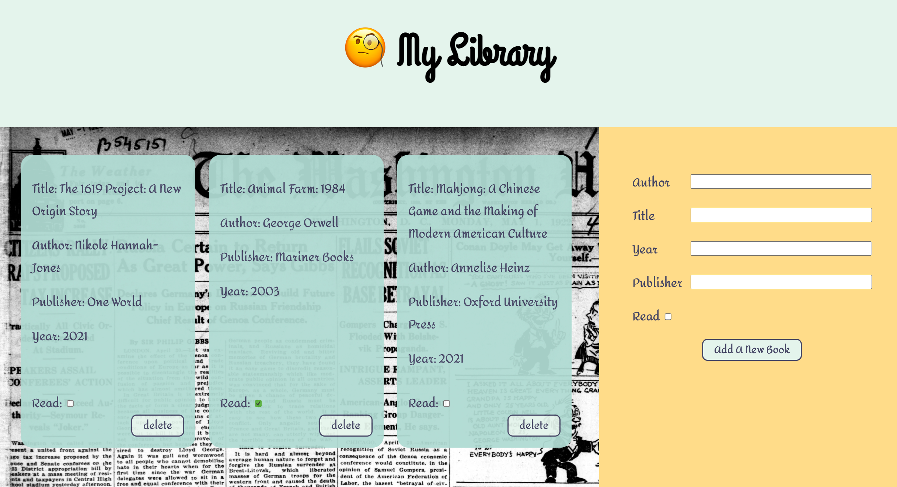

# Library 
## Demo
Click [here](https://wukongo-o.github.io/library/) to build a digital library of your own.

## Description
This project uses objects and object constructors to build a library app.  

## Features
- Keep record of each book in grid layout
- Use form element to record data
- Form validation for user input

## Built with
Pure JavaScript, CSS, HTML

Souce for background image: The Washington herald. [volume] (Washington, D.C.), 01 May 1922. Chronicling America: Historic American Newspapers. Lib. of Congress. <https://chroniclingamerica.loc.gov/lccn/sn83045433/1922-05-01/ed-1/seq-1/>
